# SMILE-IoT — Complete Project Guide

> **Local energy Monitoring and Inspection system via IoT**
> A single, read-top-to-bottom reference for the entire project: the problem it solves,
> every hardware, firmware, and software component, how data flows end-to-end, how to run
> it, its security posture, and the history of how it got here.
>
> This document is written to be self-contained. You should not need to read any code to
> understand the system after reading it — but every claim here was checked against the
> actual source, and file/line pointers are given so you can dive in when you want to.

---

## Table of contents

1. [What SMILE-IoT is (and why)](#1-what-smile-iot-is-and-why)
2. [The system in one picture](#2-the-system-in-one-picture)
3. [Repository map](#3-repository-map)
4. [Technology stack at a glance](#4-technology-stack-at-a-glance)
5. [Layer 1 — Hardware](#5-layer-1--hardware)
6. [Layer 2 — Firmware (ESP32)](#6-layer-2--firmware-esp32)
7. [The boundary — the MQTT contract](#7-the-boundary--the-mqtt-contract)
8. [Layer 3 — Software backend](#8-layer-3--software-backend)
9. [Layer 3 — Frontend (React SPA)](#9-layer-3--frontend-react-spa)
10. [Running the whole system](#10-running-the-whole-system)
11. [Security model & accepted risks](#11-security-model--accepted-risks)
12. [Project history — how it was built](#12-project-history--how-it-was-built)
13. [Roadmap & deferred work](#13-roadmap--deferred-work)
14. [Appendix A — Glossary](#appendix-a--glossary)
15. [Appendix B — File-by-file index](#appendix-b--file-by-file-index)
16. [Appendix C — Source documents](#appendix-c--source-documents)

---

## 1. What SMILE-IoT is (and why)

**SMILE-IoT** is an embedded-system prototype for **non-invasive monitoring of AC electrical
energy consumption**. You clamp a current sensor around a **single live conductor** — *without
cutting it or touching mains directly* — and the device measures how much current is flowing, estimates the
power being drawn, streams that to a server over Wi-Fi, and shows it on a live web dashboard.
It can also **remotely switch the outlet on/off** and will **automatically trip a relay** if the
current exceeds a safety limit.

### The problem it addresses

Auditing what a piece of equipment or an electrical panel actually consumes normally means
either an electrician's intervention (cutting the circuit to insert a meter) or an expensive
commercial energy monitor. SMILE-IoT does it **quickly, safely, and cheaply**: a split-core
current transformer clips over a single existing conductor, so there is no circuit interruption and no
direct electrical contact with the conductor.

### What makes it interesting technically

It sits at the intersection of two disciplines:

| Discipline | Concerns it owns in this project |
|---|---|
| **Electrical Engineering** | Analog signal acquisition, DC-bias conditioning of the sensor output, RMS-to-current calibration, mains-AC safety and isolation |
| **Software Engineering** | Real-time microcontroller firmware (FreeRTOS), IoT transport (MQTT), time-series storage, a REST API, authentication/authorization, and a live web UI |

### Scope, honestly stated

This is a **one-person prototype** ([solo developer]), currently **single-board**, run on a
**trusted LAN**. Several production concerns (TLS, broker authentication, a WSGI server,
multi-device fan-out) are deliberately deferred and explicitly tracked in
[§13 Roadmap](#13-roadmap--deferred-work). Where a shortcut was taken on purpose, this guide
says so rather than pretending otherwise.

---

## 2. The system in one picture

The architecture has three layers: **perception** (hardware sensing), **transport** (Wi-Fi +
MQTT), and **application** (the server-side stack and the dashboard).

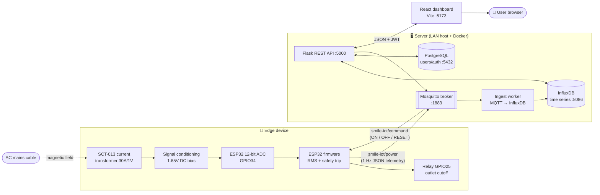

**Read it as a loop:** current flows in the cable → the CT senses it → the ESP32 measures and
publishes it once a second → Mosquitto relays it → a always-on worker archives it to InfluxDB →
the Flask API reads InfluxDB/PostgreSQL and answers the dashboard → the user sees live numbers
and can press a button → the API publishes a command back to the ESP32 → the relay switches →
the change is confirmed on the *next* telemetry reading.

### Five design principles that shape everything

These were adopted during the 2026-07 rebuild; each one fixes a concrete flaw of the earlier
Streamlit-based stack.

| Principle | What it means in practice | The flaw it kills |
|---|---|---|
| **Ingestion is a service, not a side effect** | A dedicated worker subscribes 24/7 and archives every reading | Telemetry used to be saved *only while a dashboard tab was open* |
| **The database is the interface** | Worker and API share zero memory; "latest reading" = newest InfluxDB point | Fragile in-process thread-bridge between MQTT callbacks and UI state |
| **The browser speaks HTTP only** | All MQTT lives server-side; the SPA calls REST | Each browser session used to own a broker connection |
| **One config source** | Only `backend/config.py` reads `.env`; everything imports from it | Hardcoded/committed credentials |
| **Functional first** | No ORM, no WebSockets, no queue, no cache — two small processes + a static SPA | Complexity without need for a solo prototype |

---

## 3. Repository map

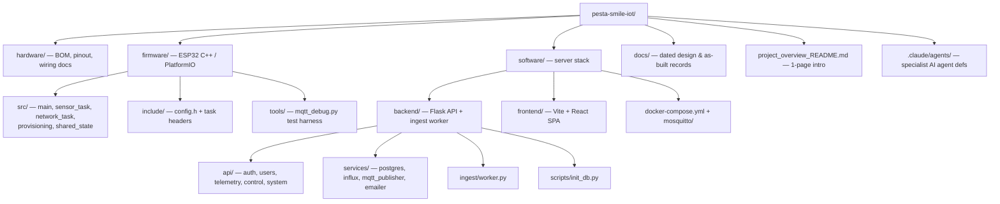

Concretely, the top level:

| Path | What it is |
|---|---|
| `hardware/` | Bill of materials, pinout, and (placeholder for) schematics/wiring diagrams |
| `firmware/` | ESP32 edge-node firmware (PlatformIO / Arduino-ESP32 / FreeRTOS), ~560 lines of C++ |
| `software/` | Everything server-side: Docker infra, Flask API, ingest worker, React SPA |
| `docs/` | Dated architecture and rewrite records — the "why" behind the current shape |
| `project_overview_README.md` | The short elevator-pitch README |
| `PROJECT_GUIDE.md` | **This file** — the complete reference |
| `.claude/agents/` | Definitions of specialist AI sub-agents scoped to firmware / backend / hardware / etc. |

Each major directory also carries its own README: `firmware/Firmware_README.md`,
`software/software_README.md`, `hardware/hardware_README.md`.

---

## 4. Technology stack at a glance

| Layer | Technology | Role |
|---|---|---|
| Sensor | SCT-013-030 (30 A / 1 V split-core CT) | Non-invasive current sensing |
| MCU | ESP32 DevKit V1 | 12-bit ADC sampling, RMS math, Wi-Fi, MQTT, relay control |
| Firmware framework | Arduino-ESP32 core (**FreeRTOS underneath**), PlatformIO | Two pinned tasks + boot/provisioning |
| Only external firmware lib | `PubSubClient` | MQTT client (JSON is hand-rolled with `snprintf`) |
| Transport | Wi-Fi + **MQTT** (Eclipse Mosquitto 2) | Pub/sub messaging between board and server |
| Ingest | Python + `paho-mqtt` v2 | Always-on MQTT → InfluxDB archiver |
| Time-series DB | **InfluxDB 2.7** | Energy readings, queried with Flux |
| Relational DB | **PostgreSQL 15** | Users, auth, audit log, reset tokens |
| API | **Flask 3.1** + `flask-jwt-extended` + `flask-cors` | REST API, JWT auth, MQTT command publish |
| DB drivers | `psycopg2` (Postgres), `influxdb-client` (Influx) | — |
| Frontend | **React 18** + **Vite 6** + **React Router 6** + **Recharts 2** | Single-page dashboard |
| Auth tokens | JWT (30-min access tokens, no refresh) | Stateless authorization |
| Orchestration | **Docker Compose** (infra only) | Broker + both databases |

Approximate sizes: firmware ~560 lines C++; backend ~1,120 lines Python; frontend ~820 lines
JS/JSX.

---

## 5. Layer 1 — Hardware

The physical device: a current transformer feeds a conditioned analog signal into the ESP32's
ADC, and a relay lets the ESP32 physically cut the outlet.

### 5.1 Bill of materials

| Qty | Part | Purpose |
|---|---|---|
| 1 | ESP32 DevKit V1 | Microcontroller (ADC, Wi-Fi, GPIO) |
| 1 | **SCT-013-030** (30 A / 1 V non-invasive CT) | Clamps over a **single conductor**, outputs a small AC voltage proportional to current |
| 2 | 10 kΩ resistors | Voltage divider → 1.65 V DC bias (mid-rail) |
| 1 | 10 µF electrolytic capacitor | Noise filtering / bias-rail stabilization |
| 1 | 3.5 mm audio-jack breakout | Mates with the SCT-013's plug |
| 1 | Relay module *(implied by firmware)* | Outlet cutoff on `GPIO25` |

### 5.2 How the SCT-013 senses current — and why it must go around *one* conductor

A **split-core current transformer (CT)** is, electrically, just a transformer whose *primary
winding is the mains conductor itself* — a single wire threaded through a ring-shaped ferrite
core — and whose *secondary* is a many-turn coil (~1,800 turns for the -030) wound on that same
core. Nothing electrically connects to the mains; the two sides are coupled **only by a magnetic
field**.

How a reading is produced, step by step:

1. **AC current → magnetic flux.** Alternating current in the conductor creates a proportional
   alternating magnetic flux in the core (Ampère's law).
2. **Flux → secondary current.** That changing flux induces an AC current in the secondary
   winding (Faraday's law), scaled *down* by the turns ratio — e.g. 20 A in the wire → ~11 mA in
   the coil at 1,800:1.
3. **Current → voltage.** The **SCT-013-030 has a burden resistor built in**, which turns that
   small secondary current into a voltage: **0–1 V AC for 0–30 A** of primary current. That "30 A
   per 1 V" rating is exactly the firmware's `CT_CALIBRATION = 30.0` A/V. The output is a
   mains-frequency (50/60 Hz) sine whose amplitude tracks the RMS current in the conductor.

**Why it must clamp a single conductor.** A CT measures the **net current enclosed by its core** —
the vector sum of everything passing through the ring. In an ordinary appliance flex, **live and
neutral run side by side inside one sheath**, carrying **equal and opposite** currents. Clamp
around the whole cable and their magnetic fields cancel:

```
around the whole cable:   +I (live)  +  −I (neutral)  =  0  →  sensor reads ≈ nothing
around one conductor:     +I (live only)             =  I  →  sensor reads the real current
```

So the CT cannot simply hug a two-core lamp cord — you need access to an **individual conductor**:
at a distribution panel, at a junction/back-box, or via a **"line splitter"** accessory that fans
the two conductors of a flex apart so you can clip onto just one. Either the live or the neutral
works, since in a series circuit both carry the same current.

**Why it's non-invasive *and* bench-safe.** "Split-core" means the ring **hinges open**, so you
clip it over a conductor without cutting or disconnecting anything. And because energy crosses the
gap only as a magnetic field (no galvanic contact), the low-voltage side is **inherently isolated**
from mains — that isolation is what makes the whole design safe to probe on a bench, and it's the
reason the [voltage caveat in §5.6](#56-the-big-hardware-caveat--voltage-is-assumed-not-measured)
matters: adding voltage sensing *breaks* this free isolation.

> ⚠️ **CT-specific hazard (the -000 variant only):** a *current-output* CT must **never** be left
> with its secondary open-circuited while clamped on a live conductor — with no burden to absorb
> the induced current, the core drives the open terminals to a **dangerously high voltage**. The
> **-030 used here is safe** on this point because its burden resistor is permanently sealed
> inside; it's still good practice to keep the 3.5 mm jack plugged in whenever the clamp is live.

### 5.3 Pinout

| ESP32 pin | Connection | Function |
|---|---|---|
| `3V3` | Resistor network | DC-bias supply → **1.65 V offset** for the sensor signal |
| `GND` | Ground | Common ground |
| `GPIO34` (`SCT_PIN`, ADC1_CH6) | Sensor output | Analog input to the 12-bit ADC |
| `GPIO25` (`RELAY_PIN`) | Relay module | Outlet cutoff (driven HIGH = on) |
| `GPIO2` (`LED_PIN`) | Built-in LED | Mirrors relay state for local indication |
| `GPIO0` (`BOOT_PIN`) | BOOT button | Hold at reset → force Wi-Fi re-provisioning |

### 5.4 Why the 1.65 V bias exists

The SCT-013 outputs an **AC** voltage that swings both positive and negative around zero. The
ESP32's ADC can only read **0 – 3.3 V** — it cannot see negative voltages. The two-resistor
divider lifts the whole signal up to sit centered on **1.65 V** (half of 3.3 V), so the full AC
waveform lands inside the ADC's readable range. The firmware then measures the *RMS of the AC
component around that bias point* (see [§6.4](#64-sensor-task--rms-math-and-the-safety-trip)).

### 5.5 Two calibration variants (documented in `config.h`)

- **SCT-013-030** (this build): burden resistor is **built into** the sensor, so it outputs a
  voltage directly → calibration factor **30 A per volt**.
- **SCT-013-000**: outputs a *current*, needs an external ~33 Ω burden resistor, giving a
  different factor (~60.6). Not used here, but noted so the code can be retargeted.

### 5.6 The big hardware caveat — voltage is *assumed*, not measured

⚠️ A current transformer **physically cannot measure voltage**. So grid voltage is a
**configuration constant**, not a measurement, and power is `P = I × V`. Because it's just a
constant, it doesn't have to live in firmware: an **admin sets it from the dashboard** (Admin
page → Device settings, stored in Postgres `app_settings`), and the **ingest worker derives**
`power_W = current_A × configured_V` and stores that voltage — overriding the firmware's own
`power_W`/`voltage_V` (which stay at the compiled-in `GRID_VOLTAGE_V` 230 V and are ignored
server-side). This lets a 120 V vs 230 V site be corrected without reflashing. It's still an
approximation of *apparent* power that ignores power factor. True voltage *sensing* requires
separate **isolated** hardware — a **ZMPT101B** module or an AC-AC wall adapter — a planned
hardware follow-up. Until then, treat power/energy figures as indicative, not billing-grade.

> **Safety note:** anything touching mains AC must respect isolation. The CT is inherently
> isolated (magnetic coupling, no galvanic contact), which is exactly why this design is
> "non-invasive" and bench-safe. Adding voltage sensing changes that risk profile and needs
> dedicated review.

---

## 6. Layer 2 — Firmware (ESP32)

The firmware was **rewritten in 2026-07** from a classic single-`loop()` Arduino sketch into a
**two-task FreeRTOS architecture** with Wi-Fi captive-portal provisioning. Full rationale lives
in [`docs/FIRMWARE_REWRITE_2026-07-08.md`](docs/FIRMWARE_REWRITE_2026-07-08.md); this section is
the self-contained summary.

### 6.1 Why two tasks instead of one loop

The old sketch did Wi-Fi housekeeping, a ~20 ms blocking ADC burst, and the overcurrent safety
check **all in one `loop()`** on a single task. Problem: if a Wi-Fi reconnect ever stalled, the
**safety check that ran after it in the same iteration was delayed by exactly that much**. For a
device whose entire justification is "trip the relay before something bad happens," coupling
safety timing to network timing is the wrong risk.

The rewrite splits the work into two explicit FreeRTOS tasks, on **different priorities** and
**different CPU cores**, connected only by a small mutex-guarded shared-state module. Sensing/
safety gets deterministic priority; networking gets whatever's left.

### 6.2 Boot sequence

`setup()` runs once, decides how to get onto Wi-Fi, then spawns the two tasks and deletes itself.

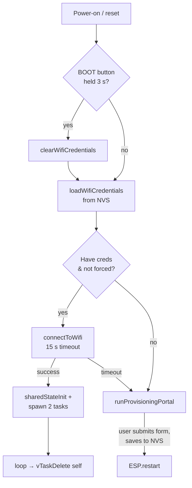

Key robustness win: the old firmware's Wi-Fi connect looped **forever** — a wrong password or an
out-of-range router bricked the device at boot. Now the attempt is **bounded to 15 s**, and on
failure it **self-heals into the provisioning portal** instead of hanging.

### 6.3 Task architecture & the shared-state channel

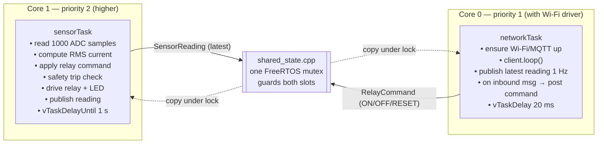

**Why a mutex, not `volatile`:** the two tasks run on **physically different cores**, genuinely
in parallel. `volatile` only prevents register caching; it says nothing about atomicity. A
`SensorReading` is four fields wide, so without a lock one task could read a half-updated struct
(a "torn read"). `shared_state.cpp` uses a single `xSemaphoreCreateMutex()` guarding **both** the
latest reading and the pending command. Every accessor takes the lock, does a cheap struct copy,
and releases — **never** holding the lock across I/O. Accessors **return copies by value** so the
caller can't race the next write, and `sharedStateConsumeRelayCommand()` **clears the slot to
`NONE`** in the same locked step, making it a proper single-shot mailbox (each command processed
exactly once, never re-processed, never missed).

The data contract (`shared_state.h`):

```cpp
struct SensorReading { float current_A; float power_W; bool outlet_state; bool trip_latched; };
enum class RelayCommand { NONE, TURN_ON, TURN_OFF, RESET_TRIP };
```

### 6.4 Sensor task — RMS math and the safety trip

**RMS measurement** (`sensor_task.cpp:readCurrentRms`): sample `analogRead()` continuously for
`CT_SAMPLE_WINDOW_US` = **100 ms** of wall-clock time (~20 µs apart), compute the mean (the DC
bias point) and the mean of squares, derive variance = `E[x²] − E[x]²`, and square-root it to get
RMS **in ADC counts**. Then convert:

```cpp
double rmsVolts   = rmsCounts * (ADC_VREF / ADC_MAX_COUNTS);  // counts → volts (3.3 / 4095)
double currentAmps = rmsVolts * CT_CALIBRATION;               // volts  → amps (30 A/V)
```

> **The calibration bug that was fixed:** the old code multiplied `rmsCounts` (raw 0–4095) by the
> calibration factor **directly**, skipping the counts→volts step. That over-reported by a factor
> of ~1241× — a real 2 A would read as ~2482 A. The safety trip could effectively never behave
> correctly. The inserted conversion is the fix.

> **The sampling-window bug that was fixed (2026-08-04):** the loop used to take a fixed
> **1000 samples** with `delayMicroseconds(20)` between them, on the assumption that this spanned
> 20 ms = exactly one 50 Hz cycle. But the real per-sample period is that delay **plus the
> `analogRead()` conversion itself** (~10–12 µs on ESP32), stretching the window to ~1.6 cycles.
> RMS over a partial cycle is biased by spectral leakage — simulation of the exact algorithm put
> the systematic error at **≈ −5%** (under-reporting) at 50 Hz. The window is now closed on
> **elapsed `micros()`** instead of a sample count: 100 ms is a whole number of cycles at *both*
> 50 Hz (5) and 60 Hz (6), so the error is ~0.02% regardless of how long the ADC takes. Timing the
> window, rather than counting samples, is what makes the cycle count independent of ADC speed.

**ADC full-scale is stated, not inherited.** The counts→volts step above is only valid if the
ADC's full-scale really is `ADC_VREF`, so `sensorTask` sets `analogSetAttenuation(ADC_11db)`
explicitly at startup rather than relying on the Arduino core's default happening to match.
11 dB is the only attenuation setting that spans the full 0–3.3 V the biased sensor signal needs.
Note this pins the *setting*, not the accuracy: individual ESP32s still vary by a few percent and
are nonlinear near the rails, which is why a calibration pass against a known load is worthwhile
before trusting absolute readings.

**The safety trip** runs inline, in the same task/priority/iteration as the measurement that
feeds it — no queue, no cross-task hop, no dependency on the network task or MQTT:

```cpp
if (currentA > CURRENT_LIMIT_A && relayOn) {   // CURRENT_LIMIT_A = 15 A
    relayOn = false;
    tripLatched = true;   // stays latched until RESET or explicit OFF
}
```

**The trip-latch state machine** (new behavior) closes a real gap: previously, once tripped, any
later `ON` message would silently re-close the relay onto an overcurrent circuit. Now the trip
**latches**, and re-arming is a deliberate two-step:

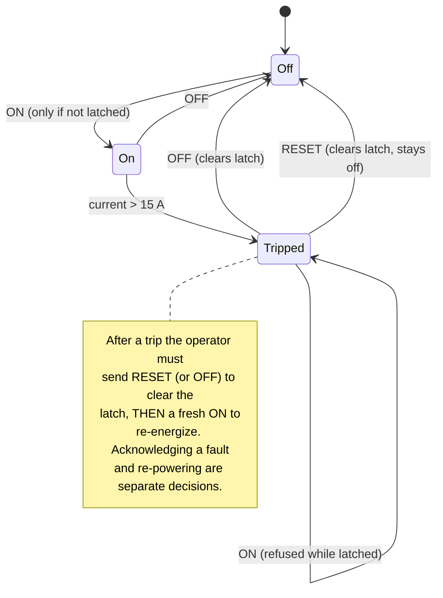

The loop closes with `vTaskDelayUntil(&lastWake, 1000 ms)`, which locks the cadence to a steady
1 Hz regardless of how long the ~20 ms sampling burst took (unlike `delay()`, which would drift).

### 6.5 Network task — MQTT, decoupled from sensing

`networkTask` owns its own `WiFiClient` + `PubSubClient` locally (only this task touches them, so
no locking needed). Each iteration: ensure Wi-Fi is up, reconnect MQTT if needed (single attempt
per iteration with a 5 s backoff — the outer `for(;;)` *is* the retry loop), service
`client.loop()`, publish the latest reading once per second, then `vTaskDelay(20 ms)` to yield.

**JSON is hand-rolled**, not built with a library:

```cpp
snprintf(payload, sizeof(payload),
  "{\"current_A\":%.3f,\"power_W\":%.1f,\"voltage_V\":%.1f,\"outlet_state\":\"%s\",\"trip_latched\":%s}",
  reading.current_A, reading.power_W, GRID_VOLTAGE_V,
  reading.outlet_state ? "ON" : "OFF", reading.trip_latched ? "true" : "false");
```

This is deliberate: the project's constraint is that **MQTT is the *only* external firmware
dependency**. `ArduinoJson` was dropped (and a long-dead `EmonLib` reference removed) because the
payload is small, flat, and fixed — `snprintf` is a complete substitute with no heap allocation.

**Inbound commands** never touch the relay directly — the callback only posts a `RelayCommand`
into shared state; `sensorTask` is the *only* code that writes the relay GPIO (a strict ownership
rule so exactly one task, after applying safety logic, decides the physical output):

```cpp
if      (msg == "ON")    sharedStateRequestRelayCommand(RelayCommand::TURN_ON);
else if (msg == "OFF")   sharedStateRequestRelayCommand(RelayCommand::TURN_OFF);
else if (msg == "RESET") sharedStateRequestRelayCommand(RelayCommand::RESET_TRIP);
```

### 6.6 Wi-Fi captive-portal provisioning

Entirely new in the rewrite (credentials used to be hardcoded). Built from **three bundled
Arduino-ESP32 components** — none of them counts against the "MQTT-only dependency" rule:

- **`WiFi.softAP`** — the ESP32 becomes its own access point `SMILE-IoT-XXXXXX` (last 3 MAC bytes,
  so multiple units don't collide), WPA2-protected by `PROVISIONING_AP_PASSWORD`.
- **`DNSServer`** — a wildcard resolver: *any* hostname a connected phone looks up resolves to the
  ESP32, which is what makes the "Sign in to network" captive-portal popup appear automatically.
- **`WebServer`** — a small HTTP server; `onNotFound` serves the provisioning page for *any* path
  (so every OS's captive-portal probe triggers the popup without enumerating them).

The form offers a scanned-SSID dropdown (with RSSI) **and** a manual field (for hidden networks;
manual takes precedence). Submitted credentials are length-validated against fixed buffers
(`strncpy` + explicit null-terminate), written to **NVS** via the `Preferences` API (a key-value
store in a dedicated flash partition that survives reflashing the app), and the device restarts.
All portal internals live in an anonymous `namespace { }` for internal linkage.

**What you actually type**, in practice:

| Thing | Value |
|---|---|
| AP name | `SMILE-IoT-XXXXXX` — `XXXXXX` = last 3 bytes of the board's MAC (e.g. `SMILE-IoT-F467F0`) |
| AP password | `smile1234` (`PROVISIONING_AP_PASSWORD`) |
| Portal address | `http://192.168.4.1` — if the captive-portal popup doesn't appear on its own |

> ⚠️ **The ESP32 has a 2.4 GHz radio only.** It cannot see, let alone join, a 5 GHz SSID. On a
> dual-band router that publishes two names (`NOS-1570` and `NOS-1570-5`), the board must be given
> the **2.4 GHz** one — even though the laptop running the server may well be sitting on the 5 GHz
> one. That's fine: both bands bridge to the same LAN, so the board still reaches the broker.
> A 5 GHz SSID simply never appears in the portal's scan list, which is the usual first clue.

**NVS survives a reflash.** This is deliberate (you don't re-provision on every firmware update)
but it has a sharp edge: *bad* credentials also survive. A board that was provisioned with a typo'd
password will keep failing after any number of reflashes until the portal overwrites them — see
[§10.6](#106-troubleshooting-a-board-that-wont-connect).

### 6.7 `config.h` — the single constants header

Every pin, calibration value, MQTT setting, provisioning parameter, and task-scheduling constant
lives in one header, grouped by concern and using typed `constexpr` (with the correct FreeRTOS
types — `UBaseType_t` for priorities, `BaseType_t` for core IDs, `TickType_t` for durations — so
the compiler flags misuse). The most important values:

| Constant | Value | Meaning |
|---|---|---|
| `CT_CALIBRATION` | `30.0` | Amps per volt (SCT-013-030) |
| `CT_SAMPLE_WINDOW_US` | `100000` | RMS window in µs — 100 ms = 5 cycles @50 Hz, 6 @60 Hz |
| `CT_SAMPLE_SPACING_US` | `20` | target µs between samples (actual = this + ADC time) |
| `ADC_VREF` / `ADC_MAX_COUNTS` | `3.3` / `4095` | 12-bit ADC scaling |
| `CURRENT_LIMIT_A` | `15.0` | Overcurrent trip threshold |
| `GRID_VOLTAGE_V` | `230.0` | Assumed nominal voltage (no sensing yet) |
| `SENSOR_PERIOD_MS` | `1000` | 1 Hz sensing/publish cadence |
| `SENSOR_TASK_PRIORITY` / `_CORE` | `2` / `1` | Higher priority, isolated core |
| `NETWORK_TASK_PRIORITY` / `_CORE` | `1` / `0` | Lower priority, Wi-Fi driver's core |
| `WIFI_CONNECT_TIMEOUT_MS` | `15000` | Bounded connect before falling to portal |
| `BOOT_BUTTON_HOLD_MS` | `3000` | Hold-to-reprovision duration |
| `MQTT_BROKER` | `192.168.1.254` | the server's LAN IP (local Mosquitto) |
| `MQTT_TOPIC_TELEMETRY` / `_COMMAND` | `smile-iot/power` / `smile-iot/command` | Topics |

> ✅ **Broker mismatch resolved (2026-08-04):** `MQTT_BROKER` now points at the LAN Mosquitto
> (`192.168.1.254`) instead of the public `broker.emqx.io`, closing the exposure where anyone on
> the internet could publish `ON`/`RESET` to the relay. The `MQTT_USERNAME` / `MQTT_PASSWORD`
> (`1211189` / `isep`) are leftovers from the public broker and are simply ignored by the
> anonymous local listener.
>
> ⚠️ **That address is DHCP-assigned.** If the server's lease changes, boards silently stop
> reaching the broker — give the server a DHCP reservation (or a static IP) on the router. Making
> the broker host a provisioning-portal field instead of a compile-time constant is the real fix;
> see [§13](#13-roadmap--deferred-work).

### 6.8 Build & verification status

Built with PlatformIO (`env:esp32dev`, `platform=espressif32`, `board=esp32dev`,
`framework=arduino`). Last recorded clean build (2026-08-04):

```
RAM:   14.0% (45,868 / 327,680 bytes)
Flash: 61.1% (800,865 / 1,310,720 bytes)
```

`lib_deps = pubsubclient` (the only external dependency). Firmware quickstart:
`pio run -t upload && pio device monitor -b 115200`.

**Verification status — what is and isn't proven.** Being precise about this matters, because the
build passing says nothing about the analog front end:

| Behaviour | Status |
|---|---|
| Compiles clean, fits flash/RAM | ✅ verified 2026-08-04 |
| Boots, reaches `setup()`, logs over serial | ✅ verified on hardware |
| Bounded Wi-Fi connect **self-heals into the portal** on failure | ✅ verified on hardware — observed falling back after a stored-credential failure |
| Captive-portal AP comes up and is joinable | ✅ AP `SMILE-IoT-F467F0` observed broadcasting |
| End-to-end telemetry from a real board into InfluxDB | ⬜ **not yet** — pending reflash + re-provision |
| 100 ms RMS window against a **known load** | ⬜ **not yet** — validated by simulation only |
| Trip latch under a *real* overcurrent | ⬜ **not yet** — never tested above 15 A |
| BOOT-hold re-provisioning | ⬜ not yet |

The whole server-side pipeline (ingest → InfluxDB → API → dashboard) **has** been exercised
end-to-end, but with **injected** MQTT traffic rather than a live board — see
[§10.4](#104-testing-without-hardware).

---

## 7. The boundary — the MQTT contract

MQTT is the **single, narrow interface** between the firmware and the server. Both sides treat it
as a contract; the field names, topics, and command strings appear once each on each side and are
kept identical.

| Direction | Topic | Payload | Cadence / QoS |
|---|---|---|---|
| board → server | `smile-iot/power` | `{"current_A":f,"power_W":f,"voltage_V":f,"outlet_state":"ON"\|"OFF","trip_latched":bool}` | 1 Hz |
| server → board | `smile-iot/command` | plain text `ON` · `OFF` · `RESET` | on demand, QoS 1 |

`RESET` clears the overcurrent latch **without** turning the relay on (a second, deliberate `ON`
is then required to re-energize).

### 7.1 Addressing — how the board finds the broker

The contract above says *what* the two sides say to each other. This says *where* they say it, and
it is the piece that most often looks broken when everything else is correct.

**There is no cloud in this architecture.** The broker is a Docker container on the development
laptop, and `docker compose` publishes port 1883 onto that laptop's network interfaces. So "the
server" is a process on a machine sitting on your LAN, and the ESP32 has to be told that machine's
**LAN address** — currently `192.168.1.254` (`MQTT_BROKER` in `config.h`).

The tempting wrong answer is `localhost`, and understanding why it fails is worth a paragraph:

| Address | Means | Correct for |
|---|---|---|
| `localhost` / `127.0.0.1` | "the machine I am running on, myself" | the **backend** → broker (same laptop) ✅ |
| `192.168.1.254` | "that specific laptop, from anywhere on the LAN" | the **ESP32** → broker ✅ |

`localhost` is not a name for any particular computer — *every* device has its own. If the ESP32
opened a connection to `localhost:1883`, it would be dialling **itself**, and the ESP32 runs no
broker. The backend gets to use `localhost` only because it happens to share a machine with the
container. The board doesn't, so it needs an address that is meaningful from off-box.

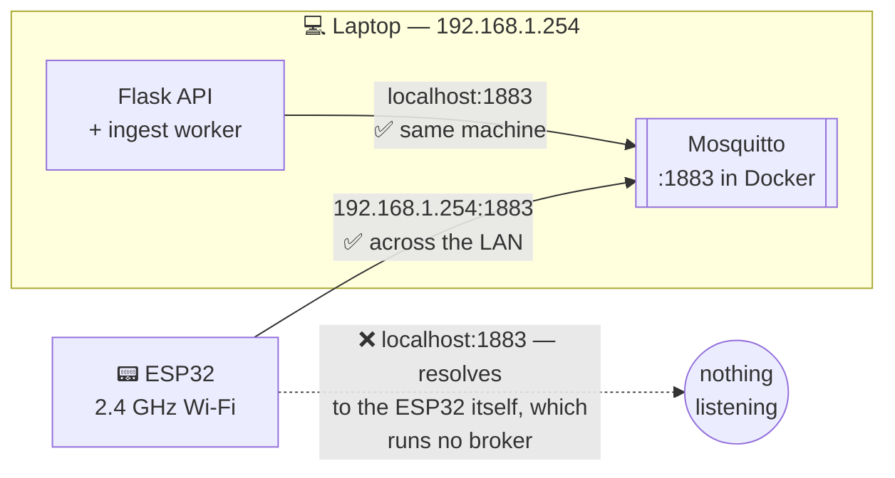

Two consequences worth planning around:

- **The address is DHCP-assigned and compiled in.** A lease change silently kills telemetry and
  costs a reflash. Mitigate now with a DHCP reservation on the router; fix properly by making the
  broker host a provisioning-portal field stored in NVS, like the Wi-Fi credentials
  ([§13](#13-roadmap--deferred-work)).
- **The broker must listen on the LAN, not just loopback.** It does — `mosquitto.conf` says
  `listener 1883` with no bind address, so it accepts on all interfaces. Verify from off-box with
  `mosquitto_pub -h 192.168.1.254 -t smile-iot/test -m hi`; a refusal there means the board will
  fail too, and the problem is the server, not the firmware.

### 7.2 A command round-trip, end to end

The crucial subtlety: **publishing a command is not the same as the relay switching.** The API
returns `202 Accepted` (broker took the message), and the UI confirms the *actual* state change
by watching the next telemetry reading.

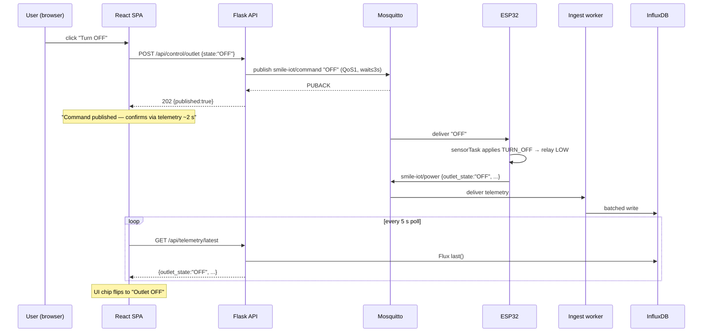

---

## 8. Layer 3 — Software backend

Rebuilt from scratch on **2026-07-09** (the earlier Streamlit stack was torn down entirely). Full
as-built reference: [`docs/SOFTWARE_ARCHITECTURE_2026-07-09.md`](docs/SOFTWARE_ARCHITECTURE_2026-07-09.md).

The server side is **two Python processes + a static SPA + three Docker containers**:

- **Ingest worker** — subscribes to `smile-iot/power` 24/7, batch-writes to InfluxDB.
- **Flask API** — reads InfluxDB/PostgreSQL, publishes relay commands, serves the SPA's REST.
- **React SPA** — the dashboard (built and served statically; dev via Vite).
- **Docker Compose** — Mosquitto, PostgreSQL, InfluxDB (infrastructure only).

### 8.1 Infrastructure (Docker Compose runs *infra only*)

The Python processes and the Vite dev server run **on the host** during development (simplest
debug loop). All persistent state lives in bind mounts under `software/data/` (gitignored), so
`rm -rf data/` + `docker compose up -d` is a full factory reset.

| Service | Image | Container | Port | Volume | Healthcheck |
|---|---|---|---|---|---|
| `mosquitto` | `eclipse-mosquitto:2` | `smile_mosquitto` | 1883 | `./data/mosquitto` | `mosquitto_sub $SYS/# -C 1` |
| `postgres` | `postgres:15` | `smile_postgres` | 5432 | `./data/postgres` | `pg_isready` |
| `influxdb` | `influxdb:2.7` | `smile_influx` | 8086 | `./data/influx` | `influx ping` |

All three have `restart: always` (survive reboots); only the host processes need manual starting.

**Mosquitto config** (`mosquitto/mosquitto.conf`): `listener 1883`, `allow_anonymous true`
(accepted on a trusted LAN — the upgrade path is `password_file` + per-topic ACLs), `persistence
true` (QoS-1 queues survive restarts). Running our own broker removes the old stack's worst
exposure: on the public `broker.emqx.io`, *anyone on the internet* could publish `ON` to the
relay.

**InfluxDB first-boot init:** the `DOCKER_INFLUXDB_INIT_*` env vars self-provision the org
(`smile_org`), bucket (`energy_data`, infinite retention), admin user, and admin token **on first
run only** (empty volume). The backend does **not** use that admin token — a **scoped**
read/write-one-bucket token is created once and pasted into `.env` as `INFLUX_TOKEN` (least
privilege: a leak can touch one bucket, not administer the instance).

### 8.2 Configuration — one reader, one file

`backend/config.py` loads `software/.env` **once at import** and exposes typed constants. **No
other module reads `os.environ`.** The full variable surface:

| Group | Variables | Consumed by |
|---|---|---|
| Postgres | `POSTGRES_USER/PASSWORD/DB`, `DB_HOST/PORT` | compose init + `services/postgres` |
| InfluxDB | `INFLUX_USER/PASSWORD/ORG/BUCKET/ADMIN_TOKEN` (init), `INFLUX_URL`, `INFLUX_TOKEN` (scoped) | compose init · backend reads/writes |
| MQTT | `MQTT_HOST/PORT`, `MQTT_TOPIC_TELEMETRY/COMMAND` | worker + publisher |
| API/auth | `JWT_SECRET_KEY`, `SESSION_TIMEOUT_MIN=30`, `COST_PER_KWH=0.25` | app factory, JWT, daily-cost |
| Login policy | `MAX_FAILED_ATTEMPTS=5`, `LOCKOUT_MINUTES=15` | lockout logic |
| SMTP | `SMTP_HOST/PORT/USER/PASSWORD`, `RESET_URL_BASE` | emailer (empty host ⇒ sending disabled) |

`.env` is gitignored; `.env.example` is the committed template (with placeholder `generate-me`
values and the exact token-creation recipe). Secrets are generated with
`python3 -c "import secrets; print(secrets.token_urlsafe(48))"`.

### 8.3 The Flask application

`backend/app.py` uses the **app-factory pattern** (`create_app()` — testable, no import-time side
effects) and **refuses to boot without `JWT_SECRET_KEY`**. Dev run: `python -m backend.app` →
`127.0.0.1:5000`, debug reloader on. Inside the factory:

1. **JWT** (`flask-jwt-extended`): access tokens carry `sub` = user id plus custom `role` and
   `username` claims; expiry = 30 min; **no refresh tokens** (on expiry the SPA drops to login).
2. **CORS**: allows `http://localhost:5173` (belt-and-braces; Vite's proxy makes dev same-origin).
3. **Uniform errors**: three JWT loaders (missing/invalid/expired) + 404/405/500 handlers all
   return the same shape `{"error":"<code>","message":"<human>"}`. Every endpoint uses
   `helpers.err()` — **the frontend has exactly one error format to parse.**
4. **Blueprints**, one per resource, mounted under `/api`.

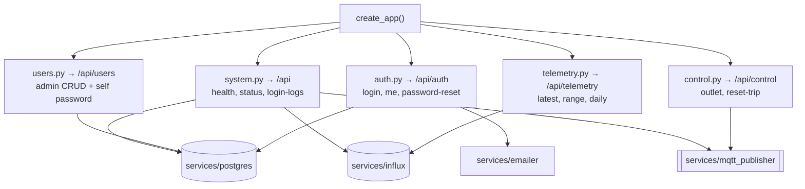

**Authorization** has two gates: `@jwt_required()` (any valid token) and `@admin_required` (also
checks the `role` claim → `403` for non-admins). Role lives **in the token**, so there is no DB
hit per request for authz; worst-case staleness (a demoted admin keeps admin rights until the
token expires) is bounded by the 30-min TTL.

### 8.4 Full API reference

Conventions: JSON bodies; `Authorization: Bearer <token>` unless *public*; errors are
`{"error","message"}`; timestamps ISO-8601 UTC.

**Auth** (`/api/auth`)

| Endpoint | Auth | Success | Errors |
|---|---|---|---|
| `POST /login` | public | `200 {access_token, user:{id,username,role}}` | `400` missing · `401 invalid_credentials` (same for unknown user — no enumeration) · `423 account_locked` + `locked_until` |
| `GET /me` | bearer | `200 {id,username,email,role}` | `401` (incl. deleted user) |
| `POST /password-reset/request` | public | **always** `202` neutral message | `429 too_many_requests` (60 s/email cooldown) |
| `POST /password-reset/confirm` | public | `200 password_updated` | `400 invalid_token \| token_used \| token_expired \| weak_password` |

With SMTP unconfigured, the reset token is logged to the API console (dev convenience) — the HTTP
response never leaks it.

**Users** (`/api/users`)

| Endpoint | Auth | Success | Errors |
|---|---|---|---|
| `GET /` | admin | `200 [{id,username,email,role,locked_until,created_at}]` | `401/403` |
| `POST /` | admin | `201 {id}` | `400 validation` (username≥3, email has `@`, password≥5, role∈{admin,user}) · `409 duplicate` |
| `PATCH /{id}` | admin | `200 {id,role}` | `400` · `404` |
| `DELETE /{id}` | admin | `204` | `404` · `409 cannot_delete_self` |
| `PUT /me/password` | bearer | `200` | `403 wrong_current_password` · `400 weak_password` |

Changing your own password **requires the current password** — an intentional hardening.

**Telemetry** (`/api/telemetry`, reads InfluxDB only)

| Endpoint | Auth | Params → Success | Notes |
|---|---|---|---|
| `GET /latest` | bearer | `200 {timestamp,current_A,power_W,voltage_V,outlet_state,trip_latched}` or `204` | `204` = no point in 5 min = **device offline** |
| `GET /range` | bearer | `minutes` (1–1440, def 60), `every` (`^\d{1,4}[smh]$`, def `10s`) → `200 {points:[{t,current_A,power_W}]}` | downsampled via `aggregateWindow(mean)` |
| `GET /daily` | bearer | `days` (1–365, def 30) → `200 {days:[{date,energy_kWh,cost_eur}]}` | cost = kWh × `COST_PER_KWH` |

**Control** (`/api/control`, publishes MQTT)

| Endpoint | Auth | Body → Success | Errors |
|---|---|---|---|
| `POST /outlet` | bearer | `{state:"ON"\|"OFF"}` → `202 {published:true}` | `400 invalid_state` · `503 broker_unavailable` |
| `POST /reset-trip` | bearer | → `202 {published:true}` | `503 broker_unavailable` |

**Settings** (`/api/settings`, global config in Postgres `app_settings`)

| Endpoint | Auth | Body → Success | Errors |
|---|---|---|---|
| `GET /grid-voltage` | bearer | → `200 {voltage_V}` | — |
| `PUT /grid-voltage` | admin | `{voltage_V:number}` → `200 {voltage_V}` | `400 invalid_voltage` (must be 80–300 V) |

**System & audit** (`/api`)

| Endpoint | Auth | Success |
|---|---|---|
| `GET /health` | public | `200 {status:"ok"}` (liveness) |
| `GET /system/status` | bearer | `200 {postgres_ok, influx_ok, mqtt_connected, last_reading_age_s}` |
| `GET /admin/login-logs?limit=` | admin | `200 {logs:[{username,success,reason,timestamp}]}` (limit 1–1000) |

`mqtt_connected` actively (lazily) connects the publisher to report broker **reachability**, not
merely "has anyone pressed a button yet."

### 8.5 PostgreSQL — users, auth, audit

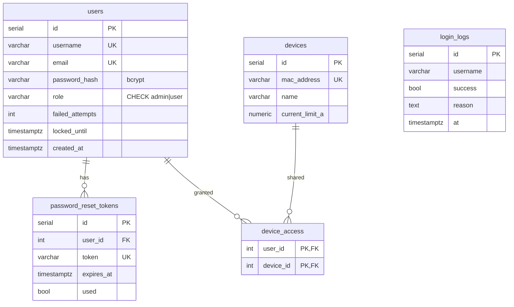

`devices` and `device_access` exist but are **unused** in single-board scope — they're
**Phase-5-ready** for multi-device permissions once firmware sends a device id. Everything uses
`TIMESTAMPTZ` with timezone-aware `datetime.now(timezone.utc)`.

**The lockout algorithm** (`services/postgres.py:verify_login`):

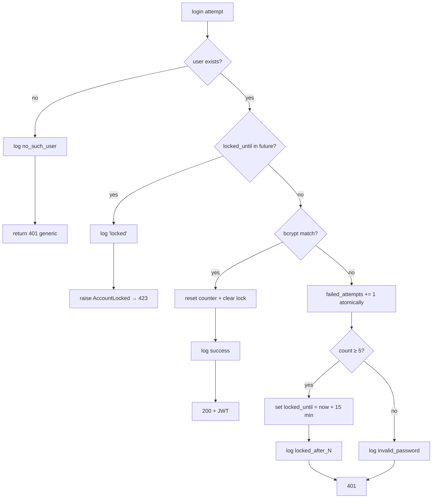

Once locked, **even the correct password returns `423`** until the window elapses. Every step
writes `login_logs`, and auditing is wrapped so it **can never break the login path** itself.
Connections are context-managed (`get_conn()` commits on success, rolls back on exception, always
closes).

**Bootstrap:** `python -m backend.scripts.init_db` is idempotent (`CREATE TABLE IF NOT EXISTS`),
seeds `admin` / `admin123` **only when the users table is empty**, and prints a change-it warning.

### 8.6 InfluxDB — the energy time series

**Point shape** written by the worker:

```
measurement: energy_reading
tag:    device = payload "mac" if present, else "SCT-013_ESP32"
fields: current_A (float), power_W (float, DERIVED = current_A × configured V),
        voltage_V (float, the admin-configured grid voltage — not from the payload),
        outlet_state (string), trip_latched (int 0/1)
time:   explicit nanosecond timestamp, set at receive (time.time_ns())
```

Two deliberate choices:

- **`outlet_state`/`trip_latched` are fields, not tags.** Tags would create a new series per value
  combination; as fields there's exactly one series per device, so a read is `last()` + `pivot()`
  → one row with every field at the same timestamp. Series cardinality stays flat.
- **Explicit timestamps.** Points without a time get server-assigned times at write; inside a
  50-point batch those can **collide and silently overwrite** each other. A nanosecond timestamp
  at receive makes every 1 Hz reading distinct.

**The three read queries** (`services/influx.py`):

- *Latest* — `range(-5m) |> filter(measurement) |> last() |> pivot(...)`. No point in 5 minutes
  ⇒ API answers `204` ⇒ UI shows the device offline.
- *Range* — `range(-{minutes}m) |> filter(current_A or power_W) |> aggregateWindow(every, mean)
  |> pivot(...)`. `every` is regex-validated (`^\d{1,4}[smh]$`) so user input never lands raw in
  Flux (injection-safe).
- *Daily* — `range(-{days}d) |> filter(power_W) |> aggregateWindow(1d, mean)`, then
  `kWh = mean_W × 24 / 1000`, `cost = kWh × COST_PER_KWH`. The mean×24 approximation is exact at
  a uniform 1 Hz cadence; `integral()` is the documented switch if cadence ever varies.

There's also `last_reading_age_s()` (seconds since the newest point, for the liveness chip).

### 8.7 Ingest worker (`backend/ingest/worker.py`)

The always-on archiver. `python -m backend.ingest.worker`.

- **paho-mqtt v2** callbacks; subscribes QoS 1; `reconnect_delay_set(1, 30)` exponential backoff;
  survives the broker starting *after* the worker (`connect_async` + `loop_forever(
  retry_first_connection=True)`).
- **Validation:** payload must be a JSON object with a numeric `current_A` (the only trusted
  field — `power_W`/`voltage_V` are derived from the configured grid voltage, see §5.6); failures
  are **counted and logged with a payload snippet** (the old stack dropped malformed messages
  silently).
- **Grid voltage** is read from Postgres and TTL-cached (~30 s) in the worker, so an admin change
  lands within ~30 s; a DB hiccup falls back to the last known value so archiving never stops.
- **Batched async writes:** `WriteOptions(batch_size=50, flush_interval=5000,
  jitter_interval=500)` — the influxdb-client batches in its own thread, so a slow/down InfluxDB
  **never blocks the MQTT loop** (the old stack wrote synchronously inside the callback).
- **Clean shutdown** (SIGTERM/Ctrl-C): disconnect → `write_api.close()` (flushes the pending
  batch) → close — **no readings lost** on restart.
- Progress log every 60 readings: `N readings ingested (M rejected)`.

### 8.8 Command publisher (`backend/services/mqtt_publisher.py`)

A **lazy module-level singleton behind a lock**: the first `POST /api/control/*` connects it
(`loop_start()` background thread), then it's reused. `publish_command()` uses QoS 1 +
`wait_for_publish(timeout=3)` so the API's `202` really means "accepted by the broker" — a dead
broker surfaces as `503 broker_unavailable`, not a silent success. `check_connection()` (used by
`/system/status`) attempts the lazy connect to report true reachability.

The worker and publisher are **separate clients with separate lifecycles** — ingest keeps
archiving even if the API is down, and vice versa.

---

## 9. Layer 3 — Frontend (React SPA)

A Vite + React 18 single-page app (React Router 6, Recharts 2). `frontend/`.

### 9.1 Dev topology

`vite.config.js` proxies `/api` → `http://127.0.0.1:5000`: the browser sees **one origin**
(`:5173`), so no CORS negotiation, no absolute URLs in code, and production can serve the built
`dist/` from anywhere that reverse-proxies `/api`.

### 9.2 Auth flow

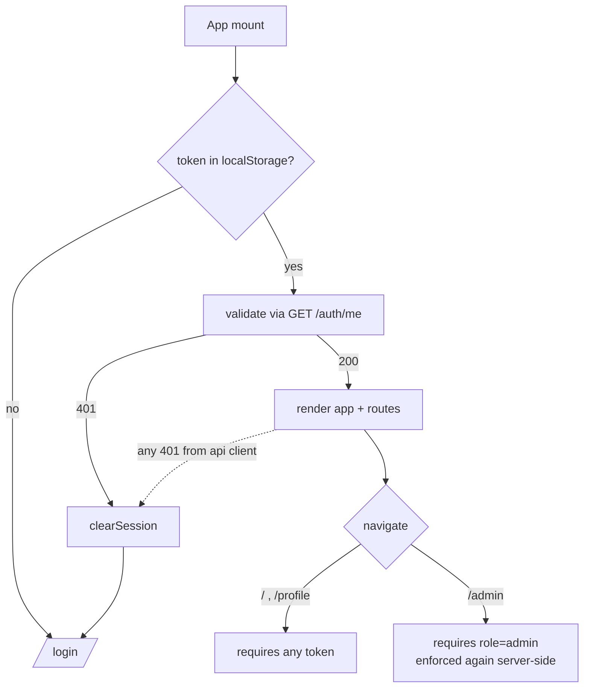

- `AuthContext` keeps `{token, user}` in `localStorage`; on mount it **validates** a stored token
  against `GET /auth/me` (catches expiry and deleted users).
- `api/client.js` is the single fetch wrapper: injects the Bearer header, parses the uniform error
  shape into a typed `ApiError`, and on **any `401`** wipes the session and flips the app to the
  login route via a registered handler.
- Route guards in `App.jsx`: unauthenticated → `/login`; `/admin` additionally requires
  `user.role === 'admin'` (and the API re-checks server-side).
- **Trade-off, accepted:** tokens in `localStorage` are XSS-readable — fine for a LAN prototype,
  revisit before any exposure.

### 9.3 Live data model

`usePolling(fn, 5000)` — an immediate call plus a 5 s interval that **skips ticks while the tab is
hidden**. Each tick fires `latest` + `range` + `daily` + `status` **in parallel** with
`Promise.allSettled`, so one failing endpoint doesn't blank the page. A window selector (15 min /
60 min / 3 h) maps to `range` params (`every` 10s/10s/1m).

| Page | Route | Consumes |
|---|---|---|
| Login | `/login` | `auth/login`, `password-reset/*` |
| Dashboard | `/` | `telemetry/*`, `control/*`, `system/status` |
| Profile | `/profile` | `auth/me`, `users/me/password` |
| Admin | `/admin` | `users*`, `admin/login-logs` |

### 9.4 Dashboard semantics

- **KPI tiles:** instant current/power from `latest`; average + peak computed from the visible
  `range` window.
- **Status chips:** device online = `last_reading_age_s ≤ 10` (≈10 missed 1 Hz beats); outlet
  ON/OFF from `latest`; broker from `mqtt_connected`.
- **Trip banner:** `trip_latched:true` renders a **critical banner** (icon + text, not
  color-alone) with a **Reset trip** button → `POST /control/reset-trip`. The old dashboard never
  surfaced this safety state.
- **Outlet buttons** disable the no-op direction (ON is disabled while already ON) and explain
  confirmation-via-telemetry after publishing ("the board confirms via telemetry within ~2 s").
- **Charts** (Recharts): power area + current line + daily-energy bars, colors from a validated
  light/dark palette in `theme.js` (power = blue, current = aqua), selected via `matchMedia`.

---

## 10. Running the whole system

### 10.1 Ports & processes

| Thing | Where | Port | Started by |
|---|---|---|---|
| Mosquitto | Docker | 1883 | `docker compose up -d` |
| PostgreSQL | Docker | 5432 | 〃 |
| InfluxDB | Docker | 8086 | 〃 |
| Flask API | host | 5000 | `.venv/bin/python -m backend.app` |
| Ingest worker | host | — | `.venv/bin/python -m backend.ingest.worker` |
| Vite dev server | host | 5173 | `cd frontend && npm run dev` |

### 10.2 First-time setup

Two kinds of local state are created that git never sees — a Python **virtual environment**
(`.venv/`) and a **secrets file** (`.env`), both gitignored. If `.env` is ever missing or out of
sync, just repeat these steps; nothing reads secrets from anywhere else.

```bash
cd software
cp .env.example .env                      # then fill in generated secrets
docker compose up -d                      # broker + databases (influx auto-inits)
# generate each `generate-me` with: python3 -c "import secrets; print(secrets.token_urlsafe(48))"
# then create the scoped Influx token (recipe in .env.example) and paste it into .env
python3 -m venv .venv && .venv/bin/pip install -r backend/requirements.txt
.venv/bin/python -m backend.scripts.init_db    # tables + admin/admin123 (change it!)
cd frontend && npm install
```

### 10.3 Run (three terminals)

```bash
.venv/bin/python -m backend.ingest.worker   # 1 — telemetry archiver
.venv/bin/python -m backend.app             # 2 — API on :5000
cd frontend && npm run dev                  # 3 — dashboard on :5173
```

Log in at <http://localhost:5173> with the seeded `admin` / `admin123`.

### 10.4 Testing without hardware

```bash
# inject one contract-shaped fake reading:
docker exec smile_mosquitto mosquitto_pub -t smile-iot/power \
  -m '{"current_A":2.4,"power_W":552.0,"voltage_V":230.0,"outlet_state":"ON","trip_latched":false}'

# watch the commands the dashboard sends:
docker exec smile_mosquitto mosquitto_sub -t smile-iot/command -v
```

`firmware/tools/mqtt_debug.py` does both interactively.

This is how the entire server-side pipeline was verified; it exercises everything except the
analog front end and the board's own Wi-Fi/MQTT client.

### 10.5 Bringing up a real board

Order matters here. Flash **before** provisioning, so you only walk the portal once.

```bash
# 1. Point the firmware at this machine, then flash it
#    (check MQTT_BROKER in firmware/include/config.h matches your LAN IP: `ip -4 addr`)
cd firmware && pio run -t upload

# 2. Watch it boot — this tells you exactly what it decided to do
pio device monitor -b 115200
```

3. **Provision.** Join the AP `SMILE-IoT-XXXXXX` with `smile1234`, browse to `192.168.4.1` if the
   captive-portal popup doesn't appear, pick the **2.4 GHz** SSID, submit. The board restarts.

4. **Confirm telemetry is flowing**, from the outside in:

```bash
docker exec smile_mosquitto mosquitto_sub -t 'smile-iot/#' -v   # raw board → broker
curl -s localhost:5000/api/telemetry/latest -H "Authorization: Bearer $TOKEN"
```

A reading on the topic but nothing in the API means the **ingest worker** isn't running; readings
in the API but a stale dashboard means the **SPA polling** or login is the problem. The layering
lets you bisect quickly.

### 10.6 Troubleshooting a board that won't connect

**Serial is the ground truth** — the boot path logs every decision it makes, so read it before
guessing. `pio device monitor -b 115200` (it needs a real terminal; if you're driving it from a
script, read `/dev/ttyUSB0` at 115200 with pyserial instead).

| Serial line | Meaning | Fix |
|---|---|---|
| `[Boot] Trying stored network 'X'...` then `No usable stored network` | Credentials **exist** in NVS but the connect failed inside `WIFI_CONNECT_TIMEOUT_MS` | Wrong password (most common), 5 GHz SSID, or out of range — re-provision |
| `[Provisioning] AP '...' up.` | Board is sitting in the portal, waiting | Join it and submit credentials |
| Connects, but no telemetry on the topic | Wi-Fi OK, MQTT not | Wrong/stale `MQTT_BROKER`, DHCP lease moved, or AP client isolation |

Quick external checks that narrow it down fast:

```bash
ls /dev/ttyUSB*                                   # board present on USB (CP210x bridge)
nmcli -f SSID,FREQ,SIGNAL dev wifi list           # is the target SSID 2.4 GHz? is it in range?
                                                  # a visible SMILE-IoT-* AP = NOT provisioned
docker exec smile_mosquitto timeout 10 mosquitto_sub -t '#' -v   # is anything arriving at all?
```

> **The trap:** a wrong Wi-Fi password in NVS **survives reflashing**, because NVS lives in its own
> flash partition ([§6.6](#66-wi-fi-captive-portal-provisioning)). Re-uploading firmware will not
> clear it — only submitting the portal form (or a BOOT-hold re-provision) overwrites it. If a
> board keeps failing on the same stored SSID after a reflash, this is why.

### 10.7 Factory reset

Stop the host processes, then `docker compose down` → `rm -rf data/` → `docker compose up -d` →
recreate the scoped Influx token → `init_db`. Because all state lives in `data/`, this is a clean
slate.

---

## 11. Security model & accepted risks

**Controls that are in place:**

| Control | Where |
|---|---|
| bcrypt password hashing (per-hash salt) | `services/postgres.py` |
| Failed-attempt lockout (5 → 15 min) + full login audit trail | 〃 |
| Neutral password-reset responses (no user enumeration) + 60 s cooldown + single-use 60-min tokens | `api/auth.py` |
| JWT expiry 30 min; role claim; `@admin_required`; self-delete blocked; current-password required to change your own | API layer |
| Scoped (single-bucket) InfluxDB token; **zero secrets in source or git** | `.env` + compose |
| Local broker instead of a public internet broker | compose |
| SQL-injection-safe (parameterized queries; Flux `every` regex-validated) | services |
| Uniform error shape (no stack traces leaked) | `app.py` / `helpers.py` |

**Accepted risks (prototype, trusted LAN — each is a conscious trade-off, not an oversight):**

- Anonymous Mosquitto on the LAN (upgrade path: `password_file` + ACLs).
- JWT stored in `localStorage` (XSS-readable).
- Seeded `admin/admin123` until changed.
- Flask **dev server** (gunicorn is the production path).
- **No HTTPS/TLS** anywhere yet.
- Broker address is a compile-time DHCP IP — a lease change silently breaks telemetry (see
  [§6.7](#67-configh--the-single-constants-header)).

---

## 12. Project history — how it was built

The repo tells a clear three-act story: a working-but-fragile first build, then two ground-up
rewrites (firmware, then the entire server stack) that traded a monolithic Streamlit app for a
properly separated architecture. The philosophy — clean-slate rebuild over debugging legacy
drift, functional simplicity, docs alongside code — is a recorded preference of the developer
([prefers rebuild and docs]).

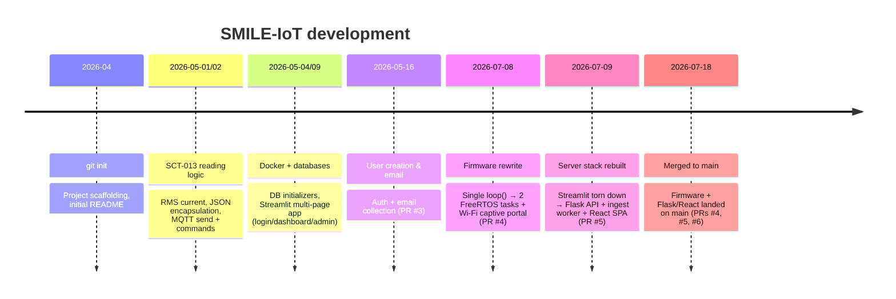

**Act I — the first build (Apr–May 2026).** SCT-013 sensing, a JSON-over-MQTT firmware sketch, a
Dockerized Postgres/InfluxDB setup, and a **Streamlit** multi-page dashboard with login and admin
views. It worked, but had structural flaws that the rebuilds were designed to eliminate:
telemetry was archived only while a dashboard tab was open; each browser session owned its own
broker connection to a *public* broker; an InfluxDB admin token was committed to source.

**Act II — the firmware rewrite (2026-07-08, PR #4).** The single-`loop()` sketch became two
pinned FreeRTOS tasks with a mutex-guarded shared state, fixing the safety/network coupling,
adding a proper overcurrent **trip latch**, adding **Wi-Fi captive-portal provisioning** (no more
hardcoded credentials), and **fixing the RMS calibration bug**. ArduinoJson and a dead EmonLib
reference were dropped so MQTT is the only external dependency. (Details:
[`docs/FIRMWARE_REWRITE_2026-07-08.md`](docs/FIRMWARE_REWRITE_2026-07-08.md).)

**Act III — the server rebuild (2026-07-09, PR #5).** The Streamlit stack was **torn down
entirely** and replaced with the five-principle architecture in [§2](#2-the-system-in-one-picture):
a standalone 24/7 ingest worker, a Flask REST API with JWT, a local Mosquitto broker, a scoped
Influx token, and a React SPA that speaks only HTTP. Fresh `.env` secrets were generated; the old
committed token died with the wiped instance. (Details:
[`docs/SOFTWARE_ARCHITECTURE_2026-07-09.md`](docs/SOFTWARE_ARCHITECTURE_2026-07-09.md).)

All of this landed on `main` on **2026-07-18** via PRs #4, #5, and #6. Branches from the earlier
era (`feature/upgrade_esp_performance`, `feature/set_sistem_4_prodReady`, etc.) remain in git
history as a record of the pre-rebuild work.

---

## 13. Roadmap & deferred work

| Item | Blocked on / note |
|---|---|
| **Broker host as a provisioning field** | `MQTT_BROKER` is a compile-time constant *and* a DHCP address, so a lease change needs a reflash; a portal field (like SSID/password, stored in NVS) removes both problems |
| **Verify the RMS window on hardware** | the 100 ms timed window is validated by simulation and a clean build, not yet against a known load on a real board |
| **Real voltage sensing** (ZMPT101B / AC-AC adapter) | needs isolated hardware; would replace the assumed `GRID_VOLTAGE_V` and enable real (power-factor-aware) power |
| **Multi-device (Phase 5)** | firmware must add a `"mac"` field (or per-device topics); the `devices` / `device_access` tables are already schema-ready |
| **Real SMTP for reset emails** | fill the `SMTP_*` vars in `.env` |
| **Containerize API + worker** | add them to compose with `restart: always` |
| **pytest suite against the compose stack** | — |
| **Production hardening** | Mosquitto auth/ACLs, HTTPS/TLS, gunicorn (replace the Flask dev server) |
| **On-device firmware validation** | flash real hardware; exercise captive portal, BOOT-hold reset, and a real overcurrent trip |
| **Harden the provisioning AP password** | `PROVISIONING_AP_PASSWORD` is a shared placeholder (`smile1234`) |

---

## Appendix A — Glossary

| Term | Meaning |
|---|---|
| **CT (current transformer)** | A sensor that measures AC current via the magnetic field around a **single conductor**, without electrical contact (clamp the whole two-wire cable and the fields cancel). Here: SCT-013-030, 30 A → 1 V. |
| **RMS** | Root-Mean-Square — the effective magnitude of an AC waveform; what you multiply by voltage to get power. |
| **DC bias** | A fixed offset (1.65 V) added so the AC signal fits in the ADC's 0–3.3 V range. |
| **ADC** | Analog-to-Digital Converter; the ESP32's is 12-bit (0–4095 counts). |
| **FreeRTOS** | The real-time OS underneath the Arduino-ESP32 core; provides tasks, priorities, mutexes. |
| **Task pinning** | Fixing a FreeRTOS task to a specific CPU core (the ESP32 has two). |
| **Mutex** | A lock ensuring only one task touches shared data at a time (prevents torn reads across cores). |
| **NVS** | Non-Volatile Storage — a flash key-value store on the ESP32 (used for Wi-Fi credentials). |
| **Captive portal** | The "sign in to network" popup pattern; here, how the device collects Wi-Fi credentials. |
| **MQTT** | Lightweight publish/subscribe messaging protocol; the board↔server transport. |
| **QoS 1** | MQTT "at least once" delivery guarantee. |
| **Broker** | The MQTT message router (Mosquitto). |
| **JWT** | JSON Web Token — a signed, stateless auth token carrying user id + role claims. |
| **Flux** | InfluxDB's query language. |
| **Trip latch** | The state where an overcurrent has cut the relay and it *stays* off until explicitly reset. |
| **SPA** | Single-Page Application — the React frontend. |

## Appendix B — File-by-file index

**Firmware** (`firmware/`)

| File | Role |
|---|---|
| `src/main.cpp` | Boot: provisioning decision → spawn tasks → `loop()` self-deletes |
| `src/sensor_task.cpp` | ADC sampling, RMS math, safety trip, relay/LED drive, publish reading |
| `src/network_task.cpp` | MQTT connect/reconnect, publish telemetry, handle inbound commands |
| `src/provisioning.cpp` | SoftAP + captive portal + NVS credential storage |
| `src/shared_state.cpp` | Mutex-guarded shared reading + command slot |
| `include/config.h` | All pins, calibration, MQTT, provisioning, and task constants |
| `include/*.h` | Task/provisioning/shared-state declarations |
| `platformio.ini` | Build config; `lib_deps = pubsubclient` |
| `tools/mqtt_debug.py` | Interactive publish/subscribe test harness |

**Backend** (`software/backend/`)

| File | Role |
|---|---|
| `app.py` | Flask app factory + dev entrypoint (`:5000`) |
| `config.py` | The single `.env` reader |
| `api/helpers.py` | `err()` + `@admin_required` |
| `api/auth.py` | login / me / password-reset |
| `api/users.py` | admin CRUD + self password change |
| `api/telemetry.py` | latest / range / daily (Influx reads) |
| `api/control.py` | outlet ON-OFF + reset-trip (MQTT publish) |
| `api/system.py` | health, stack status, login audit |
| `services/postgres.py` | auth, lockout, audit, users, reset tokens, schema |
| `services/influx.py` | the three Flux read queries + liveness |
| `services/mqtt_publisher.py` | lazy singleton command publisher |
| `services/emailer.py` | SMTP reset mail (disabled when unconfigured) |
| `ingest/worker.py` | MQTT → InfluxDB archiver process |
| `scripts/init_db.py` | one-time schema + admin seed |

**Frontend** (`software/frontend/src/`)

| File | Role |
|---|---|
| `main.jsx` / `App.jsx` | Entry + routes/guards/layout |
| `api/client.js` | fetch wrapper: JWT header, error parsing, 401 handling |
| `auth/AuthContext.jsx` | session state + token validation |
| `hooks/usePolling.js` | interval polling that pauses on hidden tab |
| `theme.js` | validated light/dark chart palette |
| `pages/{Login,Dashboard,Profile,Admin}.jsx` | the four pages |
| `components/EnergyCharts.jsx` | Power / Current / Daily charts (Recharts) |

**Infra & docs**

| File | Role |
|---|---|
| `software/docker-compose.yml` | Mosquitto + Postgres + InfluxDB |
| `software/mosquitto/mosquitto.conf` | Broker config |
| `software/.env.example` | Committed secrets template + token recipe |

## Appendix C — Source documents

This guide consolidates and cross-checks the following in-repo documents (still worth reading for
the deepest detail on their topics):

- [`project_overview_README.md`](project_overview_README.md) — one-page intro & block diagram
- [`docs/FIRMWARE_REWRITE_2026-07-08.md`](docs/FIRMWARE_REWRITE_2026-07-08.md) — firmware rewrite, line by line
- [`docs/SOFTWARE_ARCHITECTURE_2026-07-09.md`](docs/SOFTWARE_ARCHITECTURE_2026-07-09.md) — as-built server reference
- [`docs/SOFTWARE_ARCHITECTURE_2026-07-08.md`](docs/SOFTWARE_ARCHITECTURE_2026-07-08.md) — retired Streamlit stack (historical)
- [`docs/BACKEND_REFACTOR_PLAN_2026-07-08.md`](docs/BACKEND_REFACTOR_PLAN_2026-07-08.md) — the rebuild's design intent
- Per-directory READMEs: [`firmware/Firmware_README.md`](firmware/Firmware_README.md),
  [`software/software_README.md`](software/software_README.md),
  [`hardware/hardware_README.md`](hardware/hardware_README.md)

---

*Generated as a top-to-bottom project reference. Every technical claim was verified against the
source at `main` (latest commit `7518b94`). Where the code and a prior doc disagreed, the code
won.*
