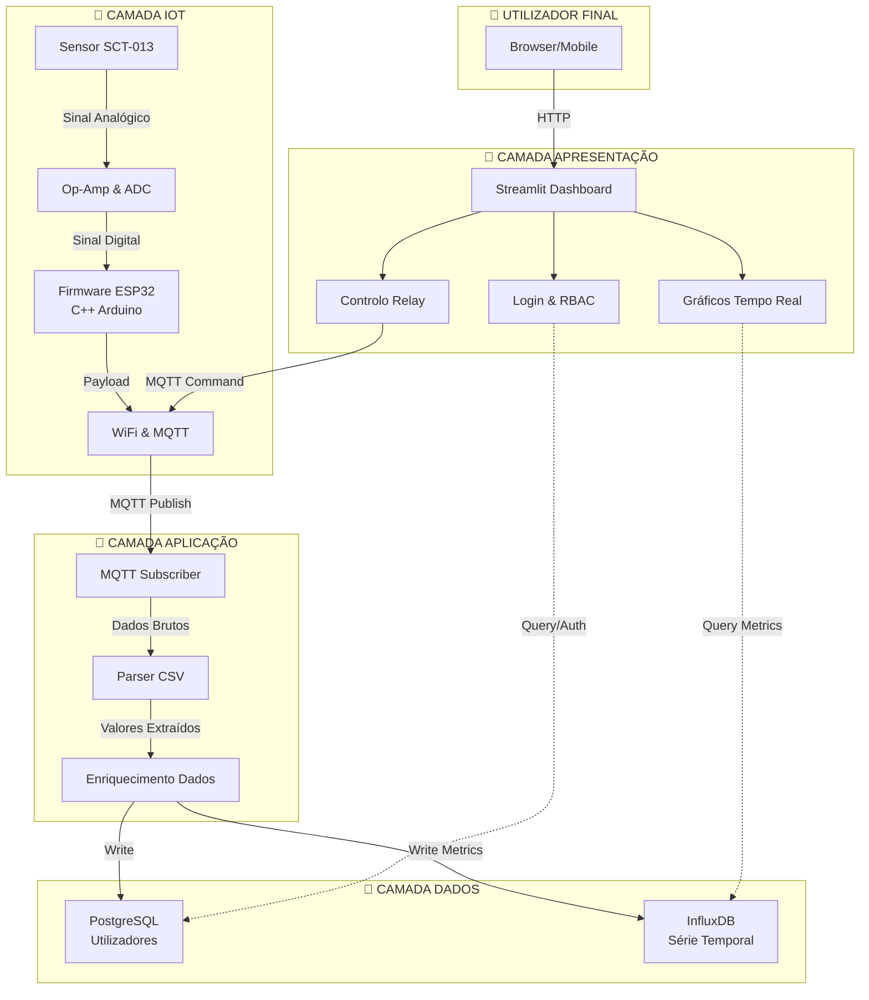
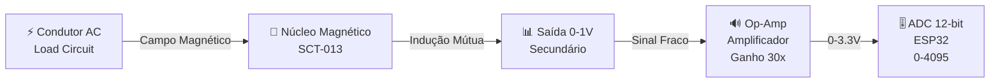
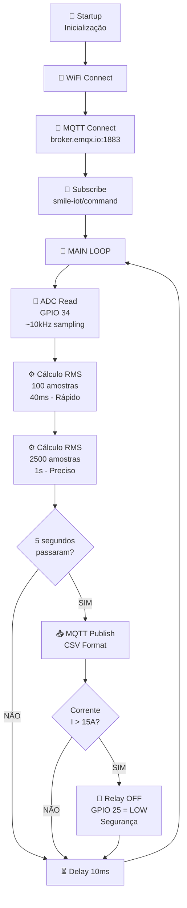
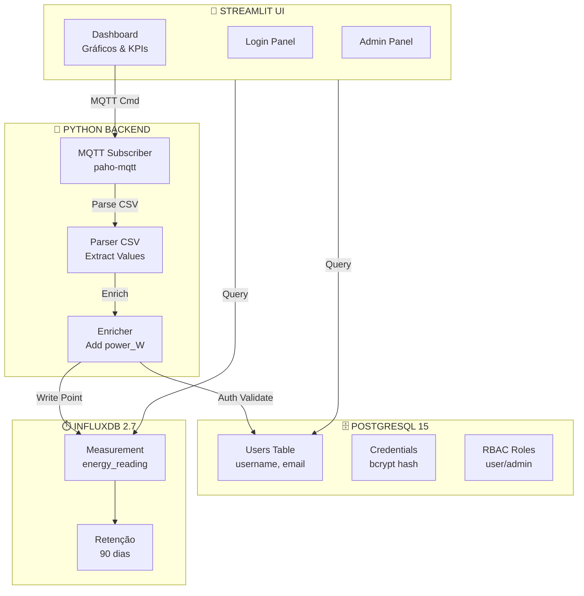
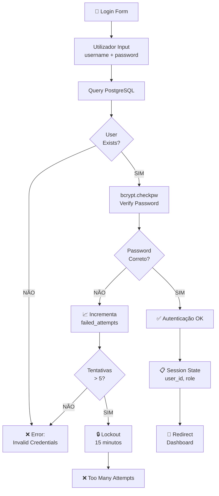
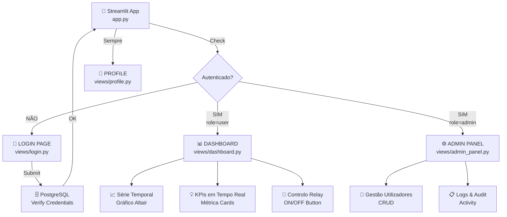
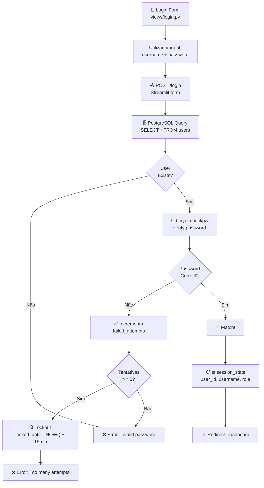
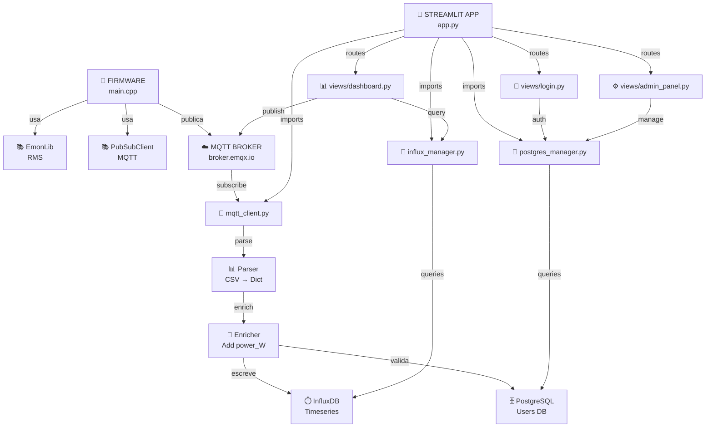
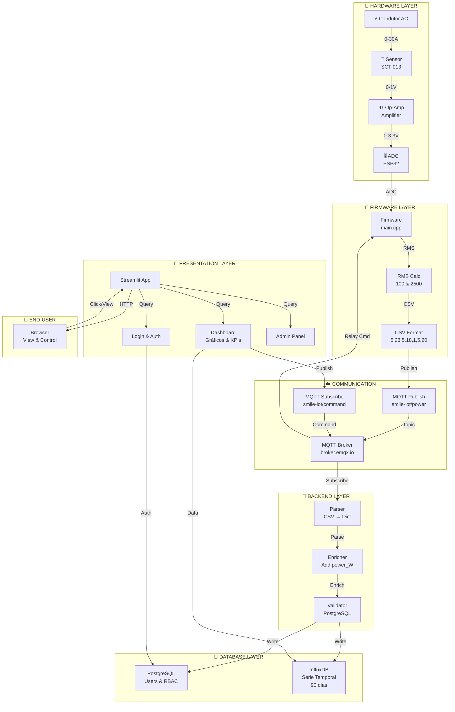

# 🏗️ SMILE-IoT Architecture Overview

## Índice
1. [Visão Geral](#visão-geral)
2. [Arquitetura em Camadas](#arquitetura-em-camadas)
3. [Componentes Principais](#componentes-principais)
4. [Fluxos de Dados](#fluxos-de-dados)
5. [Integração de Componentes](#integração-de-componentes)
6. [Tecnologias Stack](#tecnologias-stack)
7. [Segurança e Configuração](#segurança-e-configuração)
8. [Estado Atual e Roadmap](#estado-atual-e-roadmap)

---

## Visão Geral

**SMILE-IoT** é um sistema IoT de monitorização **não-invasiva** de consumo energético em instalações AC domésticas e comerciais. Funciona recolhendo leituras de sensores em tempo real, processando-as em edge (ESP32), transmitindo para backend via MQTT, e apresentando dados através de um dashboard interativo com capacidades de controlo e análise.

```
Objetivo Primário: Medir consumo energético AC sem interrupção de circuito
Precisão: ±3% em corrente, atualização: 5 segundos
Segurança: Controlo de overcurrent com relay automático
Alcance: Instalações residenciais e comerciais até 30A
```

---

## Arquitetura em Camadas

### Diagrama de Arquitetura em 4 Camadas



---

## Componentes Principais

### 1️⃣ Hardware (Percepção)

#### Sensor: SCT-013-030
- **Tipo**: Transformador de corrente AC (pinça magnética)
- **Range**: 0-30A AC, saída 0-1V
- **Precisão**: ±3%
- **Delay**: ~0.5s
- **Aplicação**: Mede corrente sem quebra de circuito (non-invasive)

**Diagrama do Sensor:**


#### Condicionamento de Sinal
- **Op-Amp**: Amplifica saída 0-1V para 0-3.3V (range do ADC do ESP32)
- **Fator de escala**: ~30x
- **Resultado**: ADC lê valores 0-4095 correspondentes a 0-30A

#### Microcontrolador: ESP32 DevKit V1
- **Processador**: Dual-core Xtensa 32-bit @ 240MHz
- **RAM**: 520KB SRAM
- **Storage**: 4MB Flash
- **WiFi**: 802.11 b/g/n (nativo)
- **ADC**: 12-bit, até 18 canais, ~10 kHz sampling
- **GPIO**: Controla relay de corte (GPIO 25)

---

### 2️⃣ Firmware (Edge Processing)

**Localização**: `firmware/src/main.cpp`

#### Fluxo de Execução Principal



#### Cálculo RMS Dual

O firmware implementa **dois tipos de RMS**:

| Tipo | Amostras | Período | Latência | Uso |
|------|----------|---------|----------|-----|
| **Rápido** | 100 | 40ms | Imediato | Detecção de overcurrent (segurança) |
| **Preciso** | 2500 | 1s | 1s | Qualidade telemetria (relatórios) |

**Fórmula RMS:**
```
I_rms = √(Σ(i_n)²) / N
```

Onde:
- `i_n` = amostra de corrente (ADC 0-4095 mapeada para 0-30A)
- `N` = número de amostras

#### Payload MQTT

**Tema**: `smile-iot/power`

**Formato**: CSV compacto (4 valores)
```csv
5.23,5.18,1,5.20
│    │    │  │
│    │    │  └─ RMS Preciso (2500 amostras)
│    │    └────── Relay Status (1=ON, 0=OFF)
│    └───────────── RMS Rápido (100 amostras)
└────────────────── Peak Instantâneo
```

**Tamanho**: ~30 bytes (vs ~200 bytes em JSON) = **85% redução**

---

### 3️⃣ Backend (Orquestração de Dados)

**Localização**: `software/`

#### Componentes



#### MQTT Client (`utils/mqtt_client.py`)

```python
# Configuração
client = mqtt.Client(client_id="smile-dashboard")
client.connect(broker="broker.emqx.io", port=1883, keepalive=60)
client.subscribe("smile-iot/power")

# Callback ao receber mensagem
def on_message(client, userdata, msg):
    # Parse CSV
    rms_fast, rms_precise, relay_status, rms_1s = parse_csv(msg.payload)
    
    # Enriquecimento
    power_W = 230V * rms_precise
    
    # Escrever para InfluxDB
    write_to_influx(current_A=rms_precise, power_W=power_W, timestamp=now)
```

#### PostgreSQL Manager (`db/postgres_manager.py`)

**Schema Principal**:
```sql
CREATE TABLE users (
    id SERIAL PRIMARY KEY,
    username VARCHAR(50) UNIQUE NOT NULL,
    email VARCHAR(100) UNIQUE NOT NULL,
    password_hash VARCHAR(255) NOT NULL,      -- bcrypt hash
    role VARCHAR(20) DEFAULT 'user',          -- 'user' or 'admin'
    failed_attempts INT DEFAULT 0,
    locked_until TIMESTAMP,                   -- Lockout após 5 tentativas
    created_at TIMESTAMP DEFAULT NOW(),
    last_login TIMESTAMP
);

CREATE TABLE password_resets (
    id SERIAL PRIMARY KEY,
    user_id INT REFERENCES users(id),
    token VARCHAR(255) UNIQUE NOT NULL,
    expires_at TIMESTAMP,
    created_at TIMESTAMP DEFAULT NOW()
);
```

**Fluxo de Autenticação**:


#### InfluxDB Manager (`db/influx_manager.py`)

**Bucket**: `energy_data`  
**Organização**: `smile_org`  
**Retenção**: 90 dias

**Schema (Measurement)**:
```
Measurement: energy_reading
├─ Tags (indexed):
│  ├─ device_id: "esp32-001"
│  └─ sensor_type: "SCT-013-030"
├─ Fields (values):
│  ├─ current_A: 5.23 (float)
│  ├─ power_W: 1202.9 (float)
│  ├─ relay_status: 1 (int, 0=OFF 1=ON)
│  └─ rms_fast: 5.18 (float)
└─ Timestamp: 2026-05-22T14:30:45Z
```

**Exemplo de escrita**:
```python
from influxdb_client import InfluxDBClient, Point
from influxdb_client.client.write_api import SYNCHRONOUS

client = InfluxDBClient(url="http://localhost:8086", token="token", org="smile_org")
write_api = client.write_api(write_options=SYNCHRONOUS)

point = Point("energy_reading") \
    .tag("device_id", "esp32-001") \
    .field("current_A", 5.23) \
    .field("power_W", 1202.9) \
    .field("relay_status", 1) \
    .time(datetime.utcnow(), WritePrecision.NS)

write_api.write(bucket="energy_data", record=point)
```

---

### 4️⃣ Dashboard (Streamlit)

**Localização**: `software/app.py` + `software/views/`

#### Estrutura de Páginas



#### Dashboard Principal

**Componentes principais**:

1. **Série Temporal (Gráfico)**
   - Query InfluxDB: últimas 24h
   - Biblioteca: Altair (vega-lite)
   - Atualização: a cada 5s (st.rerun)
   - Métrica: Corrente (A) ou Potência (W)

```python
# Query InfluxDB para últimas 24h
query = 'from(bucket: "energy_data") \
         |> range(start: -24h) \
         |> filter(fn: (r) => r._measurement == "energy_reading") \
         |> filter(fn: (r) => r._field == "current_A")'

# DataFrame + Gráfico Altair
df = client.query_api().query_data_frame(query)
chart = alt.Chart(df).mark_line().encode(x='_time', y='_value')
st.altair_chart(chart, use_container_width=True)
```

2. **KPIs em Tempo Real**
   - Corrente Atual (A)
   - Potência Atual (W)
   - Energia Acumulada (kWh)
   - Status Relay (ON/OFF)

```python
col1, col2, col3, col4 = st.columns(4)
with col1:
    st.metric("Corrente", f"{current_A:.2f} A", delta="↑ 0.5A")
with col2:
    st.metric("Potência", f"{power_W:.0f} W", delta="↑ 100W")
```

3. **Controlo de Relay**
   - Botão ON/OFF
   - MQTT Publish: `smile-iot/command` com payload `1` ou `0`
   - Feedback em tempo real

```python
if st.button("Desligar Relay", key="relay_off"):
    mqtt_client.publish("smile-iot/command", payload="0")
    st.success("Relay desligado!")
```

---

## Fluxos de Dados

### 1. Fluxo de Leitura (Telemetria)

```mermaid
graph LR
    A["⚡ Corrente AC<br/>Load Circuit"] -->|0-30A| B["🧲 Sensor<br/>SCT-013-030"]
    B -->|0-1V| C["🔊 Op-Amp<br/>Gain 30x"]
    C -->|0-3.3V| D["🎚️ ADC<br/>ESP32<br/>10kHz"]
    D -->|RMS Calc<br/>100 & 2500| E["⚙️ Firmware<br/>Calculate RMS"]
    E -->|CSV<br/>5.23,5.18,1,5.20| F["📤 MQTT Publish<br/>broker.emqx.io"]
    F -->|Topic:<br/>smile-iot/power| G["📥 Python<br/>Subscriber"]
    G -->|Parse| H["📊 Parser<br/>Extract Values"]
    H -->|Enrich<br/>Power = 230V×I| I["🧮 Enricher<br/>Add Metadata"]
    I -->|Write Point| J["💾 InfluxDB<br/>energy_reading"]
    J -->|Query 24h| K["🎨 Streamlit<br/>Dashboard"]
    K -->|HTTP| L["👥 Browser<br/>End-User"]
```



**Latência Total**: ~2-3 segundos (ADC 40ms + MQTT 500ms + Backend 500ms + Query 300ms + Render 300ms)

---

### 2. Fluxo de Controlo (Comando Bidirecional)


**Latência Total**: ~1-2 segundos (UI click 100ms + MQTT 500ms + Relay 100ms + MQTT feedback 500ms + Dashboard refresh 300ms)

---

### 3. Fluxo de Autenticação



---

## Integração de Componentes

### Diagrama de Dependências



### Matriz de Dependências

| Componente | Depende De | Fornece | Interface |
|-----------|-----------|---------|-----------|
| **Firmware** | EmonLib, PubSubClient, WiFi | MQTT Messages (CSV) | Tema: `smile-iot/power` |
| **MQTT Client** | paho-mqtt, PostgreSQL | Dados Enriquecidos | InfluxDB Write API |
| **PostgreSQL Mgr** | psycopg2, bcrypt | Validação Utilizadores | SELECT, INSERT, UPDATE |
| **InfluxDB Mgr** | influxdb-client | Query Série Temporal | InfluxDB Query API |
| **Streamlit App** | Todos os anteriores | UI Interativa | HTTP (Browser) |

---

## Tecnologias Stack

### Frontend
- **Streamlit**: Framework Python para UI web
- **Altair**: Visualização de dados (Vega-Lite)
- **Python**: Linguagem principal backend

### Backend
- **Python 3.8+**
- **paho-mqtt**: Cliente MQTT
- **pandas**: Data manipulation
- **python-dotenv**: Gestão de variáveis de ambiente

### Bases de Dados
- **PostgreSQL 15**: Utilizadores, RBAC, credenciais
- **InfluxDB 2.7**: Série temporal (energy readings)

### Orquestração
- **Docker Compose**: Containerização de serviços
- **Docker**: Isolamento de ambiente

### Segurança
- **bcrypt**: Hash de passwords
- **SMTPLIB**: Email para password reset

### Hardware
- **ESP32 DevKit V1**: Microcontrolador
- **C++ (Arduino)**: Firmware
- **PlatformIO**: Build system para firmware
- **EmonLib**: Cálculo RMS

### Comunicação
- **MQTT**: Protocol de publish-subscribe
- **broker.emqx.io**: Public MQTT broker (free tier)
- **WiFi 802.11**: Conectividade ESP32

---

## Segurança e Configuração

### Variáveis de Ambiente (`.env`)

```bash
# PostgreSQL Configuração
DB_HOST=localhost
DB_PORT=5432
DB_USER=admin
DB_PASSWORD=your_secure_password
DB_NAME=smile_iot_users

# InfluxDB Configuração
INFLUX_URL=http://localhost:8086
INFLUX_ORG=smile_org
INFLUX_BUCKET=energy_data
INFLUX_ADMIN_TOKEN=your_influx_token

# MQTT Configuração
MQTT_BROKER=broker.emqx.io
MQTT_PORT=1883
MQTT_USERNAME=your_username
MQTT_PASSWORD=your_password

# Email (Password Reset)
SMTP_SERVER=smtp.gmail.com
SMTP_PORT=587
SMTP_USERNAME=your_email@gmail.com
SMTP_PASSWORD=your_app_password

# Segurança
MAX_FAILED_ATTEMPTS=5
LOCKOUT_MINUTES=15
SESSION_TIMEOUT_MIN=30
PASSWORD_RESET_EXPIRES_MIN=60

# Logging
LOG_LEVEL=INFO
LOG_FILE=logs/app.log
```

### Segurança: Boas Práticas Implementadas

✅ **Implementado:**
- Passwords com bcrypt (hash seguro)
- Lockout após 5 tentativas falhadas
- Session management via Streamlit
- PostgreSQL com queries parametrizadas (SQL injection prevention)
- RBAC (role-based access control) user/admin

⚠️ **Em Progresso:**
- Variáveis de ambiente em `.env` (não commitado)
- MQTT sem TLS (recomendação: usar porta 8883 com TLS)

🔴 **TODO:**
- Autenticação 2FA
- HTTPS para Streamlit
- Refresh tokens
- Audit logging completo
- Encriptação de dados sensíveis em repouso

---

## Estado Atual e Roadmap

### ✅ Funcionalidades Implementadas (v0.2-beta)

| Feature | Status | Detalhe |
|---------|--------|---------|
| **Leitura RMS** | ✅ Completo | Dual mode (rápido 40ms + preciso 1s) |
| **MQTT Publish** | ✅ Completo | CSV compacto, 5s update interval |
| **PostgreSQL** | ✅ Completo | Users, RBAC, password reset |
| **InfluxDB** | ✅ Completo | 90 dias retenção, query API |
| **Dashboard** | ✅ Completo | Gráficos, KPIs, controlo relay |
| **Autenticação** | ✅ Completo | bcrypt, lockout, password reset |
| **RBAC** | ✅ Completo | user vs admin roles |
| **Controlo Relay** | ✅ Completo | ON/OFF via MQTT bidirecional |
| **Overcurrent Safety** | ✅ Completo | Relay OFF automático se I > 15A |
| **Docker** | ✅ Completo | Compose para PostgreSQL + InfluxDB |
| **Bootstrap** | ✅ Completo | Scripts automáticos setup |

### 🟡 Em Desenvolvimento

| Feature | Status | ETA |
|---------|--------|-----|
| **Testes Integração** | 🟡 Em progresso | v0.3 |
| **Refinamento InfluxDB Pipeline** | 🟡 Optimização | v0.3 |
| **Autenticação 2FA** | 🟡 Design | v0.4 |

### 🔵 Planeados (Backlog)

| Feature | Prioridade | Detalhe |
|---------|-----------|---------|
| **API REST** | 🔴 Alta | Expor dados/controlo via HTTP |
| **Alertas & Notificações** | 🔴 Alta | Email/SMS se I > threshold |
| **Múltiplos Sensores** | 🔴 Alta | Suporte n dispositivos por instalação |
| **Cálculo de Custos** | 🟡 Média | kWh → € baseado em tarifário |
| **Exportação Relatórios** | 🟡 Média | PDF/CSV com dados históricos |
| **Previsão de Consumo** | 🟠 Baixa | ML para trending (ARIMA/Prophet) |
| **Mobile App** | 🟠 Baixa | React Native ou Flutter |
| **Cloud Sync** | 🟠 Baixa | Backup remoto de dados |

---

## Diagrama de Fluxo Completo



---

## Conclusão

SMILE-IoT é um sistema **modular, escalável e seguro** para monitorização de consumo energético. A arquitetura em 4 camadas (Hardware → Firmware → Backend → Dashboard) permite fácil expansão e manutenção.

**Principais características:**
- ⚡ Leitura não-invasiva até 30A AC
- 🔒 Segurança com bcrypt + RBAC + lockout
- 📊 Série temporal com 90 dias retenção
- 🎨 Dashboard interativo em tempo real
- 🔌 Controlo bidirecional de relay
- 🚨 Proteção automática contra overcurrent
- 🐳 Fácil deployment com Docker

---

**Documentação Relacionada:**
- [SPEC.md](SPEC.md) — Especificação técnica detalhada
- [INFLUXDB_IMPLEMENTATION.md](INFLUXDB_IMPLEMENTATION.md) — Detalhes InfluxDB
- [AGENT_README.md](AGENT_README.md) — Documentação de agentes
